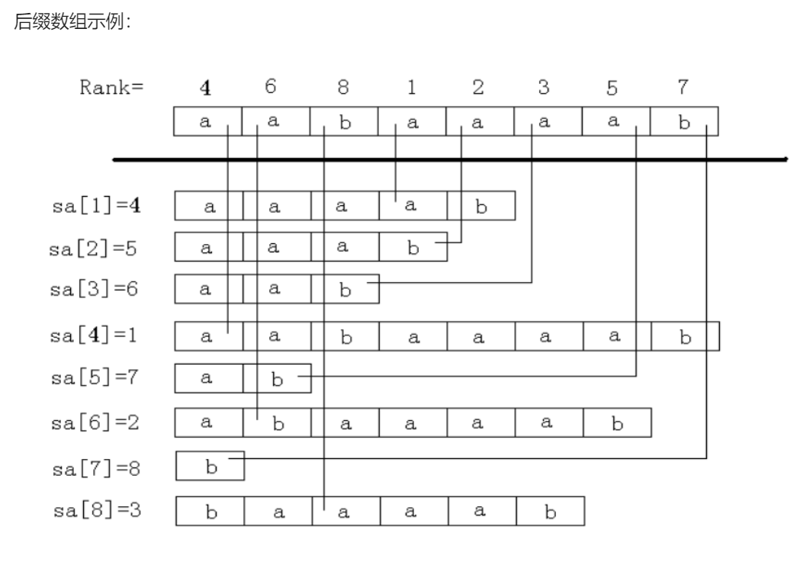
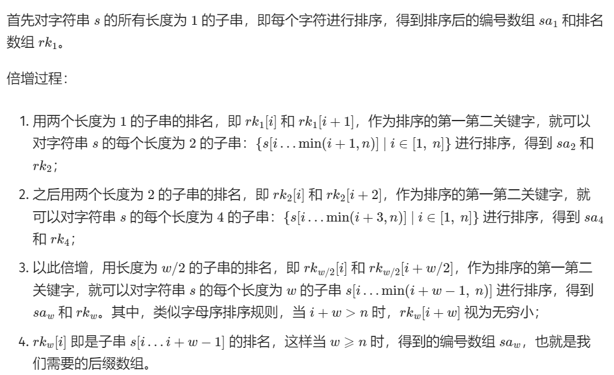
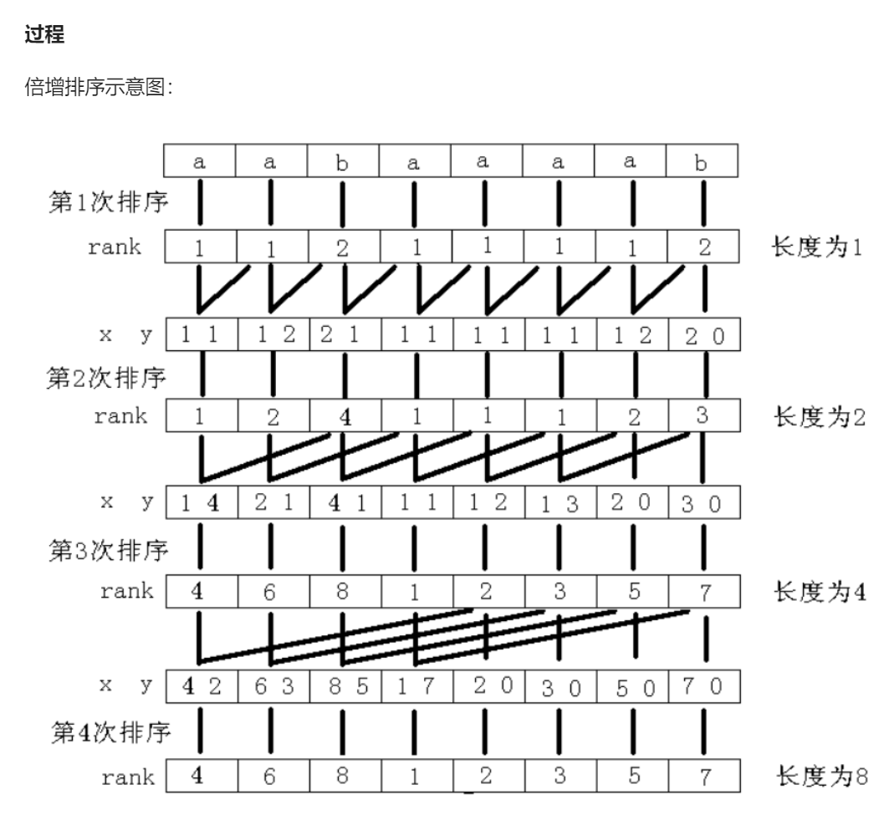

# 字典树

## 正常版
```c++
template <size_t base = 26>
class tril {
private:
    std::array<std::vector<int>, base> next;
    std::vector<bool> exist;
    int tot = 0;
public:
    tril(int sumSize):exist(sumSize) {
        for(int i = 0; i < base; ++i) next[i].resize(sumSize);
    }
    void insert(const std::string &s) {
        int p = 0;
        for(auto i:s) {
            int c = i - 'a';
            if(!next[c][p]) next[c][p] = ++tot;
            p = next[c][p];
        }
        exist[p] = 1;
    }
    bool find(const std::string &s) {
        int p = 0;
        for(auto i:s) {
            int c = i - 'a';
            if(!next[c][p]) return 0;
            p = next[c][p];
        }
        return exist[p];
    }
};
```

## 动态开点版
```c++
template <size_t base = 26>
class tril {
    using Func = std::function<int(const char)>;
private:
    std::vector<std::array<int, base>> next;
    std::vector<int> exist;
    Func func;
    static int ch(const char x) { return x - 'a'; }
public:
    tril(Func function = ch):next(1), exist(1) {
        func = function;
    }

    void insert(const std::string &s) {
        int p = 0;
        for(auto i:s) {
            int c = func(i);
            if(!next[p][c]) 
                next[p][c] = next.size(), next.emplace_back(), exist.emplace_back();
            p = next[p][c];
        }
        exist[p] = 1;
    }
    int find(const std::string &s) {
        int p = 0;
        for(auto i:s) {
            int c = func(i);
            if(!next[p][c]) return 0;
            p = next[p][c];
        }
        return exist[p];
    }
};
```

## 指针版
```c++
template <size_t base = 26>
class point_tril {
private:
    struct tril_node {
        int count;
        std::array<tril_node *, base> next;
    };
    tril_node *root; 
public:
    point_tril() {
        root = new tril_node();
    }
    ~point_tril() {
        auto dfs = [&](auto self, tril_node *p) {
            if(!p) return ;
            for(int i = 0; i < base; ++i) self(self, p->next[i]);
            delete p;
        };
        dfs(dfs, root);
    }
    void insert(const std::string &s) {
        auto p = root;
        for(auto i:s) {
            int c = i - 'a';
            if(!p->next[c]) p->next[c] = new tril_node();
            p = p->next[c];
        }
        p->count++;
    }
    bool find(const std::string &s) {
        auto p = root;
        for(auto i:s) {
            int c = i - 'a';
            if(!p->next[c]) return false;
            p = p->next[c];
        }
        return p->count;
    }
};
```

# KMP

```c++
class KMP {
	std::string pattern;
	std::vector<int> next;
	void buildNext() {
        static bool first = 0;
        if(first) return ;
        first = 1;
		for (int i = 1, j = 0; i < pattern.size(); i++) {
            while (j && pattern[i] != pattern[j]) j = next[j - 1];
            if (pattern[i] == pattern[j]) j++;
            next[i] = j;
		}
	}
public:
	std::vector<int> find(const std::string &txt) {
        buildNext();
		std::vector<int> p;
		for (int i = 0, j = 0; i < txt.size(); i++){
            while (j && txt[i] != pattern[j]) j = next[j - 1];
            if (txt[i] == pattern[j]) j++;
            if (j == pattern.size()){
				p.emplace_back(i - pattern.size() + 1);
                j = next[j - 1];
            }
        }
		return p;
	}
	std::vector<int>& get_next() { buildNext(); return next; }
	KMP(std::string& Pattern) : pattern(Pattern), next(pattern.size()) {}
};
```

# Boyer_Moore算法（等价KMP）

字符串比较算法复杂度低于KMP
约为KMP效率的**3-5倍**

```c++
class Boyer_Moore {
private:
    std::boyer_moore_searcher<__gnu_cxx::__normal_iterator<const char *, std::string>, std::hash<char>> bm;
public:
    Boyer_Moore(const std::string &s):bm{s.begin(), s.end()} {}
    std::vector<int> find(const std::string &text) {
        std::vector<int> result;
        for (auto [beg, end] = bm(text.begin(), text.end()); beg != text.end();
            std::tie(beg, end) = bm(end, text.end())) {
            result.push_back(beg - text.begin());
        }
        return result;
    }
};
```
# AC自动机

## 解释

用于多模匹配，即多个模式串匹配一个文本串

简单来说，建立一个 AC 自动机有两个步骤：
基础的 Trie 结构：将所有的模式串构成一棵 Trie。
KMP 的思想：对 Trie 树上所有的结点构造**失配指针**。
然后就可以利用它进行多模式匹配了。

```c++
//其中的count用于表示所有的最后位置
template <size_t base = 26>
class Automaton {
private:
    std::array<std::vector<int>, base> tr;
    std::vector<int> count;
    std::vector<int> fail;
    int tot = 0;
public:
    Automaton(int maxsize):count(maxsize),fail(maxsize){
        for(int i = 0; i < base; ++i) tr[i].resize(maxsize);
    }
    void insert(const std::string &s, int id) {
        int u = 0;
        for(int i = 0; i < s.size(); i++) {
            int c = s[i] - 'a';
            if(!tr[c][u]) tr[c][u] = ++tot;
            u = tr[c][u];
        }
        count[u] = id;
    }
    void build() {
        std::queue<int>q;
        for(int i = 0; i < base; i++) if(tr[i][0]) q.push(tr[i][0]);
        while(!q.empty()) {
            int u = q.front(); q.pop();
            for(int i = 0; i < base; i++) {
                if(tr[i][u]) {
                    fail[tr[i][u]] = tr[i][fail[u]];
                    q.push(tr[i][u]);
                }
                else tr[i][u] = tr[i][fail[u]];
            }
        }
    }

    std::vector<int> query(const std::string &t) {
        int u = 0;
        std::vector<int> ans;
        for(int i = 0; i < t.size(); i++) {
            u = tr[t[i] - 'a'][u];
            for(int j = u; j; j = fail[j]) {
                if(count[j]) ans.push_back(count[j]);
            }
        }
        return ans;
    }
};
```

# 优化

由于在进行query的过程中，通常需要跳转多次fail指针才能统计完全部的答案，然而跳转的过程大多是重复的，所以我们需要用tag去标记深度最深的点，然后在最后从深度最深的点向上传递标记，使用拓扑排序即可解决


# 后缀数组SA

## 定义

后缀 $i$ 代指以第 $i$ 个字符开头的后缀，存储时用 $i$ 代表字符串 $s$ 的后缀 $s[i\dots n]$。

后缀数组$（Suffix Array）$主要关系到两个数组：$sa$ 和 $rk$。

其中，$sa[i]$ 表示将所有后缀排序后第 $i$ 小的后缀的编号，也是所说的后缀数组，也称编号数组 $sa$；

$rk[i]$ 表示后缀 $i$ 的排名，是重要的辅助数组，后文也称排名数组 $rk$。

这两个数组满足性质：$sa[rk[i]]=rk[sa[i]]=i$。

## 解释



## 做法1（倍增）

基于倍增的思想



对于其中的排序，如果我们直接使用std::sort复杂度即为$O(nlog^2n)$
如果使用计数排序可以将复杂度优化至$O(nlogn)$

// TODO
```c++
```

## 做法2（哈希+二分）