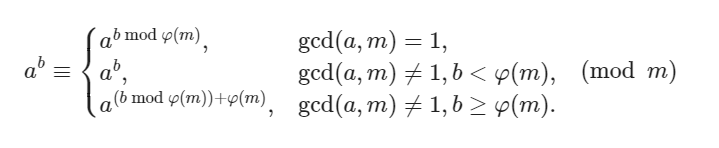
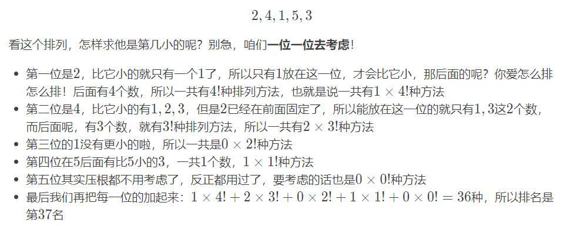

# 费马小定理

**定义：**
若$p$为质数，$gcd(a,p) = 1$，则$a^{p-1} \equiv 1(\mod p)$
另一个形式：对于任意整数$a$ ，有$a^p \equiv a(\mod p)$

# 欧拉定理

**定义：**
若$gcd(a, m)=1$，则$a^{\phi(m)} \equiv 1(\mod m)$

当 $m$ 为素数时，由于 $\varphi(m) = m - 1$，代入欧拉定理可立即得到费马小定理。

# 扩展欧拉定理

**定义：**

第二行表达的意思是：如果 $b < \varphi(m)$ 的话，就不能降幂了。

主要是因为题目中 $m$ 不会太大，而如果 $b < \varphi(m)$，自然复杂度是可以接受的。而如果 $b \ge \varphi(m)$ 的话，复杂度可能就超出预期了，这个时候我们才需要降幂来降低复杂度。

# 线性同余方程

**定义：**

形如
$$ax \equiv b(\mod n)$$
的方程称为 线性同余方程。其中，$a$、$b$ 和 $n$ 为给定整数，$x$ 为未知数。需要从区间 $[0, n-1]$ 中求解 $x$，当解不唯一时需要求出全体解。

**用逆元求解**

首先考虑简单的情况，当 $a$ 和 $n$ 互素时，即 $\gcd(a, n) = 1$。

此时可以计算 $a$ 的逆元，并将方程的两边乘以 $a$ 的逆元，可以得到唯一解。

对于不互素的情况线性同余方程的 解的数量 等于 $g = \gcd(a, n)$ 或等于 $0$。

**用扩展欧几里得算法求解**

根据以下两个定理，可以求出线性同余方程 $ax\equiv b \pmod n$ 的解。

定理 1：线性同余方程 $ax\equiv b \pmod n$ 可以改写为如下线性不定方程：

$$ ax + nk = b$$

其中 $x$ 和 $k$ 是未知数。这两个方程是等价的，有整数解的充要条件为 $\gcd(a,n) \mid b$。

应用扩展欧几里德算法可以求解该线性不定方程。根据定理1，对于线性不定方程 $ax+nk=b$，可以先用扩展欧几里得算法求出一组 $x_0$,$k_0$，也就是 $ax_0+nk_0=\gcd(a,n)$，然后两边同时除以 $\gcd(a,n)$，再乘 $b$。就得到了方程
// TODO

# 同余方程

**定义：**
对正整数 $m$ 和一元整系数多项式 
$f(x)=\sum_{i=0}^n a_ix^i$，其中未知数 $x\in\mathbf{Z}_m$，称形如

$f(x) \equiv 0 (\mod m)$的方程为关于未知数 $x$ 的模 $m$ 的一元 同余方程。

若 $a_n\not\equiv 0\pmod m$，则称上式为 $n$ 次同余方程。

类似可定义同余方程组。

// TODO

# 康托展开

**定义：**

对于一个$1$到$n$的排列${a_1, a_2,..., a_n}$，字典序比它小的排列的数量有：
$$\sum_{i=1}^{n} sum_{a_i} \times (n - i) !$$

其中$sum_{a_i}$表示在$a_i$后面的元素里比它小的元素个数，即$\sum_{j=i}^{n}(a_j \lt a_i)$

**解释：**

