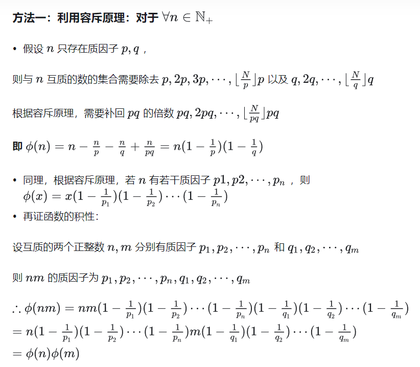

# 欧拉函数的定义：    
$\phi(x)$ 代表 在$1$ ~ $n$ 中， 与 $n$ 互质的数的个数

----

# 欧拉函数的性质：    
- 1. 若$p$是质数，则$\phi(p)=p-1$
- 2. 若$p$是质数，则$\phi(p^k)=(p-1)p^{k-1}$
- 3. 积性函数：若$gcd(m,n)=1$，则$\phi(mn)=\phi(m)\phi(n)$
---
# 欧拉函数的计算公式
由唯一分解定理得 
$$
n=\prod^s_{i=1}p_i^{\alpha_i}=p_1^{\alpha_1}p_2^{\alpha_2}p_3^{\alpha_3}...
$$  
得到
$$
\phi(x)=n\times\prod^s_{i=1} \frac{p_i-1}{p_i}=n\times\frac{p_1-1}{p_1}\times\frac{p_2-1}{p_2}\times...\times\frac{p_s-1}{p_s}
$$

---
# 欧拉函数的计算方法：
- 1. 对于单个数的欧拉函数的求法:    设$x_1, x_2, x_3, ...$ 为$n$的质因子，  按照公式 
$$
\phi(n) = n \times \frac{x_1-1}{x_1} \times \frac{x_2-1}{x_2} ...
$$
即可求得
```c++
int ans = n; 
for(int i = 2; i * i <= n; ++i){
    if(n % i == 0){
        ans = ans * (i - 1) / i;
        while(n % i == 0) n /= i;
    }
}
if(n > 1) ans = ans * (n - 1) / n;
```
##

- 2. 对于$1$ ~ $n$内所有数字的欧拉函数的求法：  
（类似素数筛法）    
我们知道在线性筛中，每个合数都是被它最小的质因子筛掉的。    
我们可以假设$p_j$是$m$的最小质因子，则$m$可以通过$p_j\times i$筛掉。
由此我们可以分类讨论：  
> 若$i$能被$p_j$整除,则表示$i$包含了$m$的所有质因子
$$
\phi(m)=m\times \prod^s_{k=1}\frac{p_k-1}{p_k}=p_j\times i \times \prod^s_{k=1}\frac{p_k-1}{p_k}=p_j\times \phi(i)
$$\
>若$i$不能被$p_j$整除,则$i$和$p_j$是互质的
$$
\phi(m)=\phi(p_j\times i)=\phi(p_j)\times \phi(i)=(p_j-1)\times\phi(i)
$$

由此得出代码
```c++
std::vector<int>phi(n + 1), prime;
std::vector<bool>vis(n + 1);

phi[1] = 1;

for(int i = 2; i <= n; ++i){
    if(!vis[i]){
        prime.push_back(i);
        phi[i] = i - 1;
    }
    for(int j = 0; i * prime[j] <= n; ++j){
        int k = i * prime[j];
        vis[k] = 1;
        if(i % prime[j] == 0){
            phi[k] = prime[j] * phi[i];
            break;
        }else phi[k] = (prime[j] - 1) * phi[i]; 
    }
}
//其中phi数组即为每一位的欧拉函数值
```
